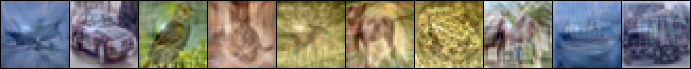
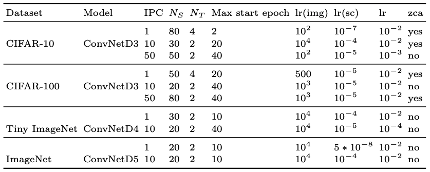
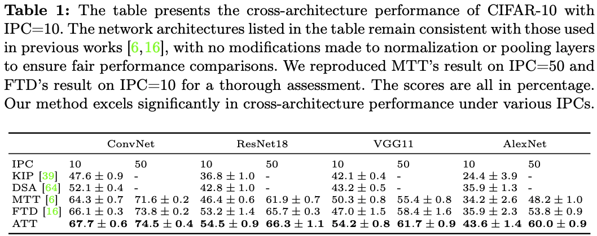
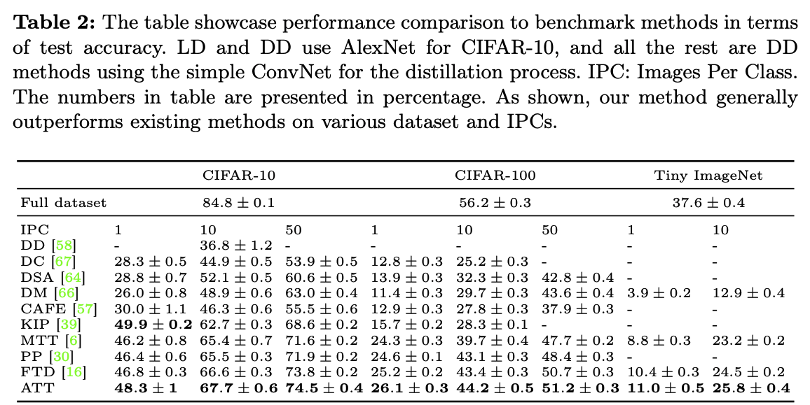
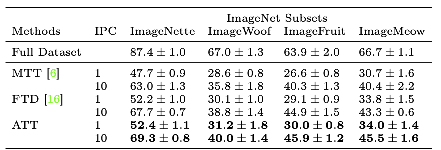

# Dataset Distillation by Automatic Training Trajectories



## Steps to run
This repository contains code for training expert trajectories and distilling synthetic data for the paper: Dataset Distillation by Automatic Training Trajectories. The listed is the steps to run the code.
1. Set up enveriments.
2. Create an wandb account for monitoring distillation process (highly recommended but optional)
3. Create buffers which contain expert trajectories.
4. Distill and test synthetic datasets

## Set up enveriments
You can install packages from requirements.txt with pip 

```
pip install -r requirements.txt
```
In case of conflicts, you can check our packages details in requirements_detail.txt including versions and dependencies.

## Create an wandb account for monitoring distillation process
We use wandb to monitor our distillation process and system information. The tool is used by a lot of dataset distillation aythors. We strongly recommand reviewers to use this tool as well for visualize the process.

You can easily register an account at https://wandb.ai/site
, then get an API key at https://wandb.ai/authorize?_gl.

When running the distillation code, you will only need to select the option declaring that you have an wandb account, and input your API key. After this, you will be able to monitor the distillation process in https://wandb.ai/site.

In case you don't want to use wandb, please just add in "mode='disabled'" into to wandb init in distill_ATT.py line 67.

## Create buffers which contain expert trajectories.
Before doing distillation, we need to generate expert trajectories on the original dataset.

### Create buffers for CIFAR10, CIFAR100
```
python buffer_ATT.py --dataset=CIFAR10 --model=ConvNetD3 --train_epochs=50 --num_experts=100 --zca --data_path=data --buffer_path=buffer
```
Please change --dataset=CIFAR10 to CIFAR100 for results on CIFAR100. "--zca" indicate with zca, simply remove it for cases without zca

### Create buffers for Tiny
```
python buffer_ATT.py --dataset=Tiny --model=ConvNetD4 --train_epochs=50 --num_experts=100 --data_path=data --buffer_path=buffer
```

### Create buffers for ImageNet
```
python buffer_ATT.py --dataset=ImageNet --subset=imagenette --model=ConvNetD5 --train_epochs=50 --num_experts=100 --data_path=--data_path=data --buffer_path=buffer
```
Please change augment "--subset=imagenette" to imagenette, imagewoof, imagefruit,  imagemeow. 

## Distill synthetic datasets
After creating and storing the expert trajectories, we will distill synthetic dataset with the following parameters.



We used the following command in experiments:
### CIFAR10:
IPC = 1:
```
python3 distill_ATT.py --dataset=CIFAR10 --model=ConvNetD3 --ipc=1 --zca --syn_steps=80 --expert_epochs=4 --max_start_epoch=2 --lr_img=1e2 --lr_lr=1e-07 --lr_teacher=1e-2 --ema_decay=0.9999 --eval_it=100 --Iteration=6000 --buffer_path=buffer --data_path=data
```
IPC = 10:
```
python3 distill_ATT.py --dataset=CIFAR10 --model=ConvNetD3 --ipc=10 --zca --syn_steps=30 --expert_epochs=2 --max_start_epoch=20 --lr_img=1e04 --lr_lr=1e-04 --lr_teacher=1e-02 --ema_decay=0.9999 --eval_it=100 --Iteration=60000 --buffer_path=buffer --data_path=data
```
IPC = 50
```
python3 distill_ATT.py --dataset=CIFAR10 --model=ConvNetD3 --ipc=50 --syn_steps=50 --expert_epochs=2 --max_start_epoch=40 --lr_img=1e02 --lr_lr=1e-05 --lr_teacher=1e-03 --ema_decay=0.999 --eval_it=1000 --Iteration=1000000 --buffer_path=buffer --data_path=data
```

### CIFAR100:
IPC = 1:
```
python3 distill_ATT.py --dataset=CIFAR100 --model=ConvNetD3 --ipc=1 --zca --syn_steps=50 --expert_epochs=4 --max_start_epoch=20 --lr_img=500 --lr_lr=1e-05 --lr_teacher=1e-02 --ema_decay=0.9995 --eval_it=10 --Iteration=3000 --buffer_path=buffer --data_path=data
```
IPC = 10:
```
python3 distill_ATT.py --dataset=CIFAR100 --model=ConvNetD3 --ipc=10 --syn_steps=20 --expert_epochs=2 --max_start_epoch=40 --lr_img=1e3 --lr_lr=1e-05 --lr_teacher=1e-2 --ema_decay=0.9995 --eval_it=5000 --Iteration=200000 --buffer_path=buffer --data_path=data
```
IPC = 50
```
python3 distill_ATT.py --dataset=CIFAR100 --model=ConvNetD3 --ipc=50 --zca --syn_steps=80 --expert_epochs=2 --max_start_epoch=40 --lr_img=1e3 --lr_lr=1e-05 --lr_teacher=1e-2 --ema_decay=0.999 --eval_it=100000 --Iteration=100000 --batch_syn=1200 --buffer_path=buffer --data_path=data
```

### Tiny ImageNet:
IPC = 1:
```
python3 distill_ATT.py --dataset=Tiny --model=ConvNetD4 --ipc=1 --syn_steps=30 --expert_epochs=2 --max_start_epoch=10 --lr_img=1e04 --lr_lr=1e-04 --lr_teacher=1e-02 --ema_decay=0.999 --eval_it=10 --Iteration=10000 --buffer_path=buffer --data_path=data
```
IPC = 10:
```
python3 distill_ATT.py --dataset=Tiny --model=ConvNetD4 --ipc=10 --syn_steps=20 --expert_epochs=2 --max_start_epoch=40 --lr_img=1e04 --lr_lr=1e-06 --lr_teacher=1e-03 --ema_decay=0.999 --eval_it=100 --Iteration=80000 --buffer_path=buffer --data_path=data
```

### ImageNet:
IPC = 1:
```
python3 distill_ATT.py --dataset=ImageNet --subset=imagenette --model=ConvNetD5 --ipc=1 --syn_steps=20 --expert_epochs=2 --max_start_epoch=10 --lr_img=1e4 --lr_lr=5e-08 --lr_teacher=1e-02 --ema_decay=0.9999 --eval_it=10 --Iteration=10000 --buffer_path=buffer --data_path=data
```
replace augment "--subset=imagenette" with imagewoof, imagenette, imagefruit, imagemeow to distill other subsets.
IPC = 10:
```
python3 distill_ATT.py --dataset=ImageNet --subset=imagenette --model=ConvNetD5 --ipc=10 --syn_steps=20 --expert_epochs=2 --max_start_epoch=10 --lr_img=1e04 --lr_lr=1e-04 --lr_teacher=1e-2 --ema_decay=0.999 --eval_it=1000 --Iteration=100000 --buffer_path=buffer --data_path=data
```
Similar to case when IPC = 1, you can change augment "--subset=imagenette" with imagewoof, imagenette, imagefruit, imagemeow to distill other subsets.

### Show cross-architecture performance on CIFAR10 with IPC=10:
```
python3 distill_ATT.py --dataset=CIFAR10 --model=ConvNetD3 --ipc=10 --zca --syn_steps=30 --expert_epochs=2 --max_start_epoch=20 --lr_img=1e04 --lr_lr=1e-04 --lr_teacher=1e-02 --ema_decay=0.9999 --eval_it=100 --Iteration=60000 --buffer_path=buffer --data_path=data --eval_mode='M'
```
### Show cross-architecture performance on CIFAR10 with IPC=50:
```
python3 distill_ATT.py --dataset=CIFAR10 --model=ConvNetD3 --ipc=50 --syn_steps=30 --expert_epochs=2 --max_start_epoch=40 --lr_img=1e02 --lr_lr=1e-05 --lr_teacher=1e-03 --ema_decay=0.999 --eval_it=1000 --Iteration=1000000 --buffer_path=buffer --data_path=data --eval_mode='M'
```

## Table of results
You can find the following table of results for different dataset as a reference to reproduce.

Cross-architecture performance:


Test accuracy on ConvNet:



## Code reference
https://github.com/AngusDujw/FTD-distillation/tree/main?tab=readme-ov-file

https://github.com/GeorgeCazenavette/mtt-distillation

https://github.com/VICO-UoE/DatasetCondensation

https://github.com/kuangliu/pytorch-cifar

https://github.com/BIGBALLON/CIFAR-ZOO

https://gist.github.com/rwightman/f2d3849281624be7c0f11c85c87c1598

